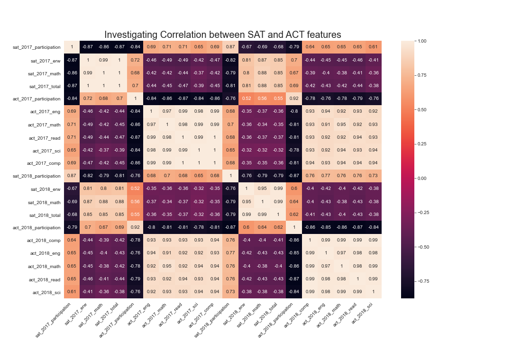
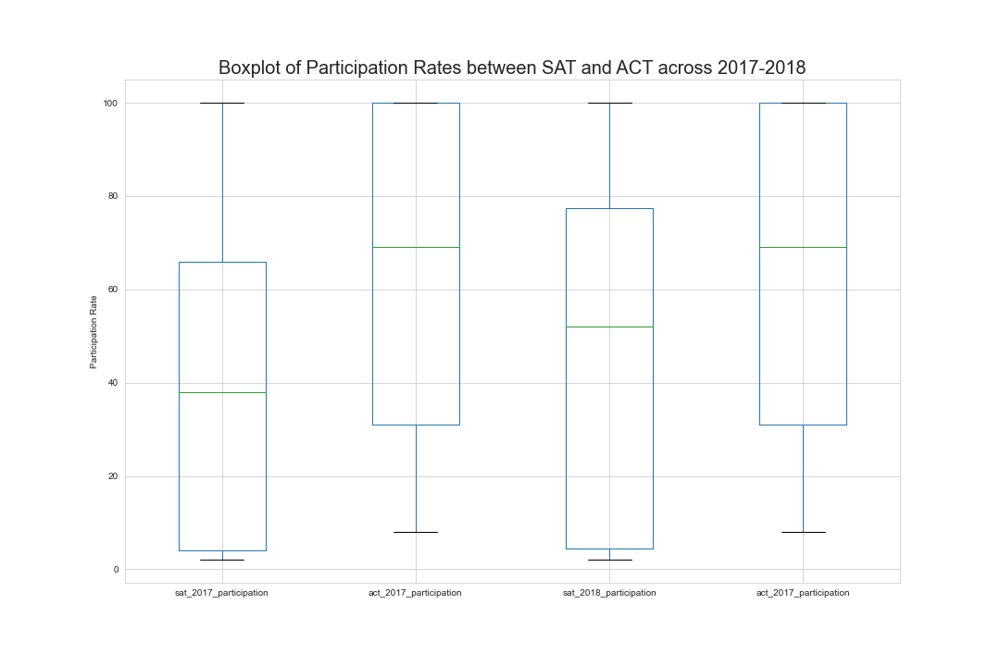
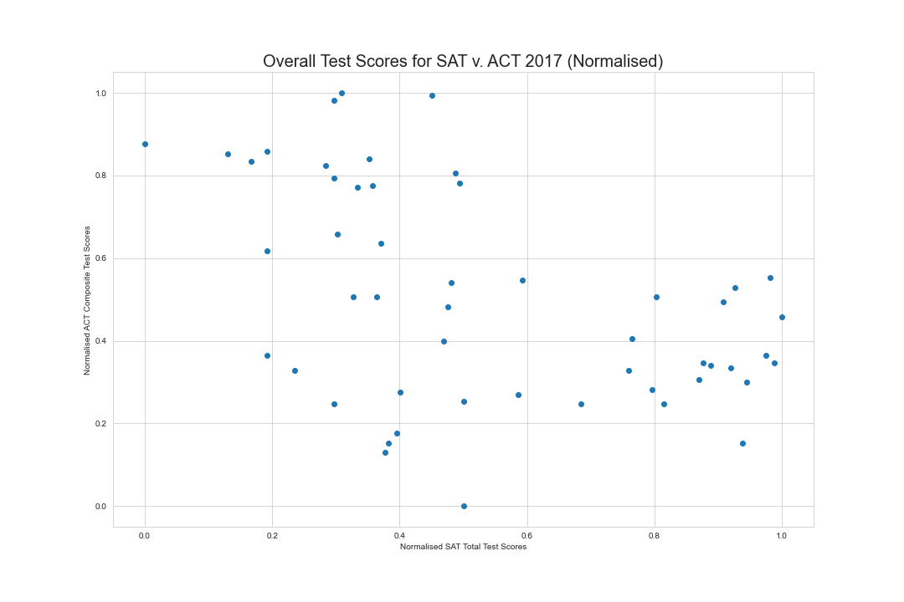
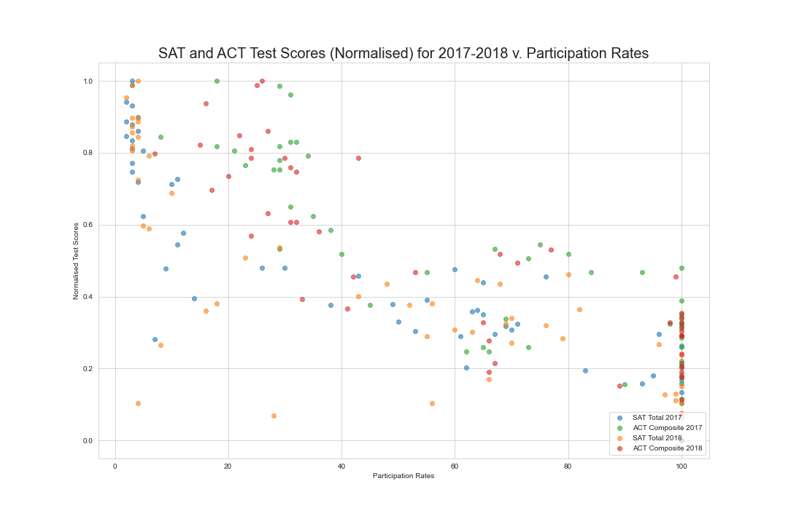
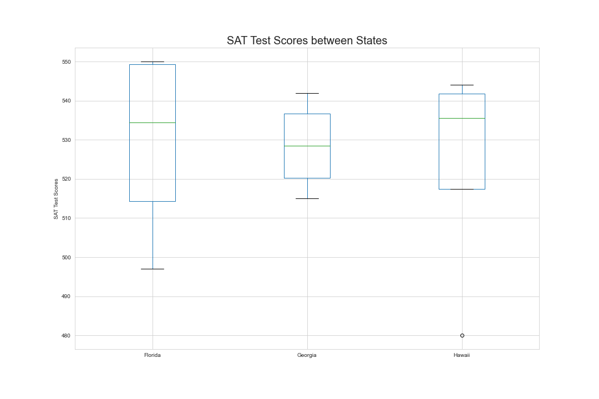
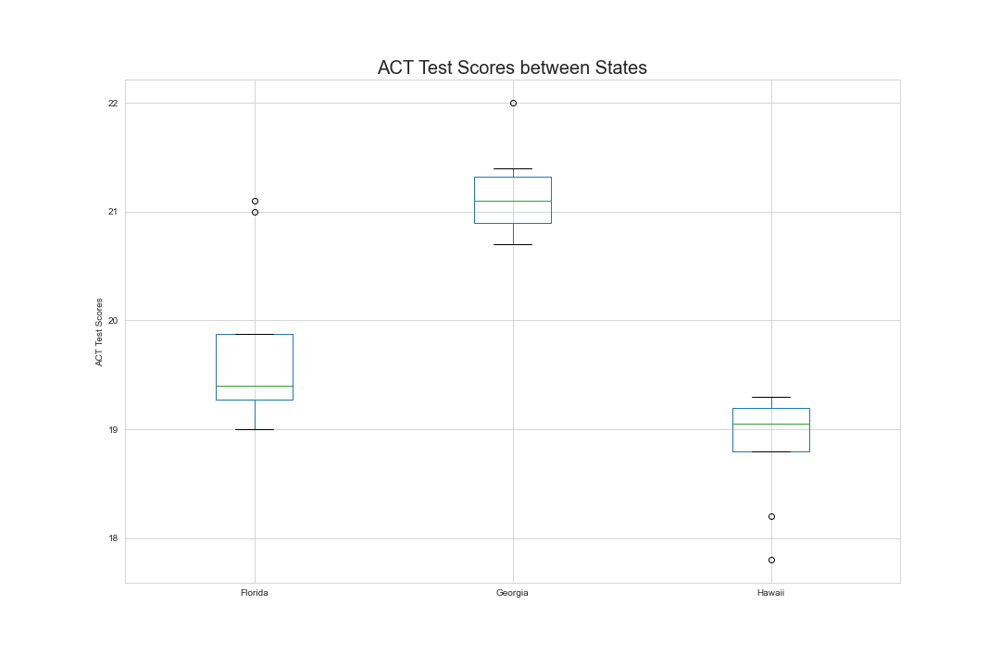

#  Project 1:<br>Raising SAT Participation Rates - An Analysis of SAT and ACT

### Overview

Representing College Board, this project seeks to garner insights by evaluating SAT against our biggest competitor, ACT, from the past 2017 and 2018 datasets. In the tumultuous landscape of college admissions today still reeling from the Covid-19 pandemic and the ongoing national uprising for racial justice, it is this project's hopes that by contrasting past performances yet untainted by recent events, we can derive specific insights that will gain us the competitive edge over ACT that aren't skewed by the Test-Optional movement. While a general pivot in testing is likely necessary for all test providers, this project hopes to provide a picture of what this pivot could look like and to provide recommendations that will allow SAT to come out ahead when the dust settles.

Through the iterative process of data exploration and analysis, this project is of the hypothesis that the SAT test is too difficult as compared to the ACT. While this project attempts to demonstrate this fact, this issue remains pertinent whether objectively true or not. There lies a general perception that the SAT is more difficult than the ACT as can be seen from questions and articles such as [this](https://www.quora.com/Why-is-the-SAT-harder-than-the-ACT), and [this](https://blog.prepscholar.com/is-the-act-easier-than-the-sat), and even [this article](https://www.collegeraptor.com/getting-in/articles/myths/myth-the-act-is-easier-than-the-sat/) that sought to dispel the myth that the SAT is the more difficult test. The perpetuation of such myths, even if untrue, skews the national perception of SAT, which in turn may dissuade potential test takers.

As test providers that aim to provide standardised testing to give all students a fair evaluation and opportunity for use in  college admissions, this perception of a more difficult test does us no favour in the college admissions scene. This project concludes with some recommendations for the next course of action.

---

### Executive Summary

Please use the following links to get around:

- [Getting Started](#Executive-Summary)
- [Datasets](#Working-with-Data)
- [Analysis and Evaluation](#Key-Takeaways)
- [Recommendations](#Looking-Forward)

#### Python Libraries

This project uses the following libraries:

- `numpy`: For all mathematical methods
- `pandas`: For its dataframe capailities
- `scipy`: For its range of statistical methods
- `matplotlib`: For creating charts and plots
- `seaborn`: For its additional styles and features in plotting
- `sklearn`: For its MinMaxScaler method to normalise data

---

### Working with Data

[Back to Top!](#Executive-Summary)

#### Provided Data

This project draws on the following datasets:

- [2017 SAT Scores](./data/sat_2017.csv)
- [2017 ACT Scores](./data/act_2017.csv)
- [2018 SAT Scores](./data/sat_2018.csv)
- [2018 ACT Scores](./data/act_2018_updated.csv)

These data give the average SAT and ACT scores by state, as well as participation rates, for the graduating class of 2017 and 2018.

You may find the source for the SAT 2017 data [here](https://blog.collegevine.com/here-are-the-average-sat-scores-by-state/), the source for the ACT 2017 data [here](https://blog.prepscholar.com/act-scores-by-state-averages-highs-and-lows), the source for the SAT 2018 data [here](https://blog.prepscholar.com/what-is-the-average-sat-score), and the source for the ACT 2017 data [here](https://blog.prepscholar.com/good-act-score-for-2018).

#### Data Cleaning

After importing and evaluating the DataFrames with the `info` method, it is discovered that certain columns containing numeric values are of the wrong data type. For some, the issue is obvious. For example, although participation rates are recorded as integers, they are parsed as string objects because they include the `%` string character. For others where errors are harder to spot, for-loops and custom functions were used to check through to spot errors.

```
# checking Composite
# since "Composite" values are of str type, we are unable to eval its values as numbers
col = "Composite"
for x in act_2017[col]:
    try:
        float(x) # testing to see if values are numeric
    except:
        print(f"{x} is not a float object for score {col}.") # print x that cannot be converted to float and is not numeric
```

Above is an example of a for-loop to highlight the error value in column that is preventing Python from parsing the data as float objects. However, as the need arose to include and clean other datasets in the project, a custom function was defined to automate the checking of the data. Two custom functions were written, one each for SAT and ACT as their columns are necessarily different.

```
def check_sat(dataframe):
    
    # check for duplicate/missing States
    print("There are {} States in the dataset.".format(dataframe["State"].nunique()))
    
    # check that participation rates are between 0-100%
    for rate in dataframe["Participation"]:
        if rate<0 or rate>100:
            print(f"{rate}% participation rate is out of range.")
    print("Check is completed. Unlisted participation rates are in range between 0-100%.")
    
    # check test scores are between 200-800
    cols = ["Evidence-Based Reading and Writing", "Math"]
    for col in cols:
        for score in dataframe[col]:
            if score<200 or score>800:
                print(f"{score} score for {col} is out of range.")
        print(f"Check is completed. Unlisted {col} test scores are in range between 200-800.")
    
    # check total test scores are between 400-1600
    for score in dataframe["Total"]:
        if score<400 or score>1600:
            print(f"{score} total score is out of range.")
    print("Check is completed. Unlisted total test scores are in range between 400-1600.")   
```

```
def check_act(dataframe):
    
    # check for duplicate/missing States
    print("There are {} States in the dataset.".format(dataframe["State"].nunique()))
    
    # check that participation rates are between 0-100%
    for rate in dataframe["Participation"]:
        if rate<0 or rate>100:
            print(f"{rate}% participation rate is out of range.")
    print("Check is completed. Unlisted participation rates are in range between 0-100%.")
    
    # check test scores are between 1-36
    cols = ["English", "Math", "Reading", "Science", "Composite"]
    for col in cols:
        for score in dataframe[col]:
            if score<1 or score>36:
                print(f"{score} score for {col} is out of range.")
        print(f"Check is completed. Unlisted {col} test scores are in range between 1-36.")
```

As the SAT and ACT datasets come with predictable columns (note: column names may vary), and the SAT and ACT have a fixed range of test scores, these custom funtions could be written to check each column for fundamental errors. For future use, do note that these functions assume that each column is already of the appropriate data type, and that these functions do not cover for outliers that are in range. For outliers, it is suggested that you plot a boxplot to check for outliers so you can cross-check after to ensure that the anomaly exists and is not simply a case of erroneous data entry.

#### Data Dictionary

Below is the Data Dictionary for the final DataFrame.

|Feature|Type|Dataset|Description|
|---|---|---|---|
|**state**|*string*|common|Dataset covers 50 States and 1 Federal District (District of Columbia) in USA.|
|-|-|-|-|
|**sat_2017_participation**|*integer*|SAT 2017|Participation rate of SAT assessment in percentage points (%) by State for the year 2017.|
|**sat_2017_erw**|*integer*|SAT 2017|Average score of the Evidence-Based Reading and Writing (ERW) section in the SAT assessment by State for the year 2017. A possible score ranges from 200-800.|
|**sat_2017_math**|*integer*|SAT 2017|Average score of the Math section in the SAT assessment by State for the year 2017. A possible score ranges from 200-800.|
|**sat_2017_total**|*integer*|SAT 2017|Average total score of the SAT assessment by State for the year 2017. Total score is calculated with the sum of both ERW and Math sections of the SAT. A possible score ranges from 400-1600.|
|-|-|-|-|
|**act_2017_participation**|*integer*|ACT 2017|Participation rate of ACT assessment in percentage points (%) by State for the year 2017.|
|**act_2017_eng**|*float*|ACT 2017|Average score of the English section in the ACT assessment by State for the year 2017. A possible score ranges from 1-36.|
|**act_2017_math**|*float*|ACT 2017|Average score of the Math section in the ACT assessment by State for the year 2017. A possible score ranges from 1-36.|
|**act_2017_read**|*float*|ACT 2017|Average score of the Reading section in the ACT assessment by State for the year 2017. A possible score ranges from 1-36.|
|**act_2017_sci**|*float*|ACT 2017|Average score of the Science section in the ACT assessment by State for the year 2017. A possible score ranges from 1-36.|
|**act_2017_comp**|*float*|ACT 2017|Average composite score of the ACT assessment by State for the year 2017. Total score is calculated with the mean of all sections (English, Math, Reading, Science) of the ACT. A possible score ranges from 1-36.|

---

### Key Takeaways

[Back to Top!](#Executive-Summary)

#### Comparison of Participation Rates 



From the heatmap above, we can observe a strong negative correlation between SAT and ACT participation rates. This is especially noticeable when you look into States with 100% participation of either SAT or ACT. These are also the States with mandatory testing sourced from either test providers. A function was defined to track these participatory shifts in allegiance.

```
def particip_shifts(df17, df18):
    mask17 = df17["state"].isin(df18["state"])
    mask18 = df18["state"].isin(df17["state"])
    for state in df17[~mask17]["state"]:
        print(f"{state} has a 100% participation rate in 2017 but not 2018.")
    print("")
    for state in df17[mask17]["state"]:
        print(f"{state} has a 100% participation rate in both 2017 and 2018.")
    print("")
    for state in df18[~mask18]["state"]:
        print(f"{state} has a 100% participation rate in 2018 but not 2017.")
```

Do note that the above function accepts two DataFrames filtered already for a 100% participation rate by year. The results of this function highlighted two things of note. First, it is that ACT has greater institutional support than SAT. There are 17 States using ACT's services for both 2017 and 2018. SAT had the support of only 4 States in 2017 and 5 States in 2018.



The boxplot above reiterates the point of a strong national/institutional support for the ACT.

Second, Colorado very interestingly switched allegiance from ACT in 2017 to SAT in 2018 and went from a SAT participation rate of 11% to 100%. Colorado's participation rate for ACT fell from 100% to 30%. This change in allegiance is documented [here](https://www.testive.com/colorado-sat-change-2017/) and State-released material explaining their reasons for switching test providers ca be found [here](https://www.coloradokids.org/wp-content/uploads/2016/01/ACTvsSAT_FINAL.pdf). This speaks to the power of the institution. Pursuing State-administered tests where standardised testing is mandated is the grand prize to snag. However, such opportunities do not come easily nor often.

Since the State plays a large part in advocating for a certain test (for example, by covering the test fees in State-administered tests), the participation rates between SAT and ACT are usually inversely correlated. Therefore, it would be interesting to filter out States that have participation rates greater than 50% for both SAT and ACT for a given year. This was done with a simple for-loop which yielded the following result in 2018.

> Florida has a participation rate greater than 50% for both SAT and ACT.  
Georgia has a participation rate greater than 50% for both SAT and ACT.  
Hawaii has a participation rate greater than 50% for both SAT and ACT.  
North Carolina has a participation rate greater than 50% for both SAT and ACT.  
South Carolina has a participation rate greater than 50% for both SAT and ACT.  

In 2017, there were three States with participation rates greater than 50% for both SAT and ACT. In 2018, States that fit these criterias grew to five, of which the original three were still present. These three States were Florida, Georgia, and Hawaii. Does the high testing rate in each of these States indicate a greater demand for and a growing culture of testing?

#### Comparison of Academic Performance

The heatmap plotted in the before-mentioned chapter shows strong internal positive correlation for the respective SAT and ACT test components. By sorting through the DataFrame, we are able to find the top and worst performing State in terms of SAT and ACT performance. For the SATs, Minnesota was top performer and D.C. the worst performer for both 2017 and 2018. For the ACTs, New Hampshire was the top performer for 2017 and Connecticut the top performer for 2018. Nevada performed the poorest for ACT in both 2017 and 2018.

Going deeper, the project pursued an interest in each States' academic aptitude and if their aptitude were fairly assessed to the same standard. As both SAT and ACT are scored on different scales, it would not be very useful to evaluate them in a direct comparison. There was therefore a need to normalise the respective test scores to a scale between 0 and 1.

```
scaling = MinMaxScaler() # create scaler obj

# min-max Normalisation
filtered_array_norm = scaling.fit_transform(filtered_array) # normalise language scores
# array matrix obj generated after scaling
# filtered_array_norm[:,0] accesses first column
# filtered_array_norm[:,1] accesses second column
```

The bit of code above made use of `sklearn` MinMaxScaler method to transform and scale the array along a single axis. By normalising the data, we are now able to compare between SAT and ACT test scores and evaluate States' performance.



From the scatter plot above, we can observe that SAT and ACT are negatively correlated because the top-right and bottom-left quadrants are almost free of markers. The large cloud of markers indicate a large variance in the relationship which makes it difficult to read for a strong negative correlation. However, we should bear in mind that this negative correlation is an unnatural phenomenon for standardised testing which only came about because the population tested in each State is in itself not standardised. This results in the phenomenon where States with low participation rate in a test as a rule scores highly in the respective test, and vice versa. For example, as explained [here](https://blog.prepscholar.com/average-sat-scores-by-state-most-recent), in States with mandatory SAT tests, only the most diligent and confident candidates would take additional ACT tests to bolster their college applications. Therefore, this unnatural negative correlation between SAT and ACT scores is a sympton of the natural and prevailing trend of negative correlation between SAT and ACT participation rates.



As the test scores are unnaturally skewed by each States' individual preference for test providers, we can begin to account for participation rate by plotting test scores against participation. The above scatter plot is also colour-coded to show SAT and ACT test scores through 2017 and 2018. By weighing each test score with participation rate, we are able to see a pattern emerge. From the distribution of the markers, it appears that for a given percentage point in participation, we should observe a higher ACT test score than SAT. This begins, in part, to prove our hypothesis that the SAT is the more difficult test.

> SAT has a normalised mean test score of 0.51 in 2017.  
ACT has a normalised mean test score of 0.483 in 2017.  
SAT has a normalised mean test score of 0.446 in 2018.  
ACT has a normalised mean test score of 0.479 in 2018.  

Running a series of formatted string queries for the mean normalised test score for each year and each test, we can see that while the normalised ACT test score hovered at within 1% year on year, the SAT test score (although the easier test in 2017) became the more difficult test in 2018. Plotting the regression lines above for SAT and ACT in the scatter plot further drives home the point that the SAT test is more difficult.

---

### Looking Forward

[Back to Top!](#Executive-Summary)

#### Florida, Georgia, and Hawaii

Florida, Georgia, and Hawaii are what this project will refer to as on-the-fence States. These States each have a participation rate of more than 50% for both 2017 and 2018. On-the-fence States are interesting because they indicate a consumer demand for testing outside of institutional mandates. None of these States have a 100% participation rate in either SAT or ACT. Rather than lobby State departments (while high effort and possibly high reward, the political climate right now does not favour standardised testing), we can instead pursue present and alive grassroot demand for testing. Each of these on-the-fence States present their own unique education landscape and opportunities. We investigate deeper into where these opportunities lie.



Florida appeared to have the strongest SAT performance, but with a long tail that indicated trailing test takers. Georgia's performance was just a little weaker than the other two, but it has the tightest variance and the least skew. Hawaii has a generally strong (but skewed) performance except for an outlier poor test score.



We see greater disparity between the ACT performances here. As a whole, the variance in their performance is also smaller for all 3 States. Florida's performance is generally weak with a couple outlier test results that outperformed its State cohort. Georgia's performance is the strongest of the three except for a single outperforming outlier. Hawaii's performance is the weakest of the three with a couple underperforming outliers.

How indicative are the boxplots of the efficacy of the school system of these on-the-fence States? By weighing our interpretations above against the State's respective mean participation rate in standardised testing, we can qualify our evaluation of their school system.

**Participation Rates (%)**
|State|SAT 2017|ACT 2017|SAT 2018|ACT 2018|SAT mean|ACT mean|
|---|---|---|---|---|---|---|
|Florida|83|73|56|66|69.5|69.5|
|Georgia|61|55|70|53|65.5|54|
|Hawaii|55|90|56|89|55.5|89.5|

Keeping in mind that participation rates and test scores have an inverse relationship, a few things stood out from studying the boxplots.

For Florida, it is its relatively large variance in SAT test scores. However, this spread could be explained away by the substantial drop in its SAT participation rate from 83% to 56%, which likely saw a substantial difference in SAT test scores. It follows that its ACT test score variance was much more contained with an ACT participation rate of 73% and 66%.

With Georgia, it is its overall strong performance and narrow variance in both SAT and ACT that stood out. Its SAT performance is comparable with the other States at a mean SAT participation rate of 65.5%. Hawaii did only marginally better but its mean participation rate is a whole 10% lower, which suggests either that Georgia is strong academically or that Hawaii is rather poor. Georgia's ACT results was head and shoulders above the rest, but with only a mean ACT participation rate of 54% as compared to the other 69.5% and 89.5%, this strong showing should be taken with a pinch of salt.

For Hawaii, its seemingly weaker performance in the ACT stood out. Upon closer look, while its poor ACT performance can be explained away by its very high mean ACT participation rate of 89.5%,  it is its SAT scores that indicate that more strongly its weaker academic performance. With only a 55.5% mean SAT participation rate (10% lower than Georgia and 14% lower than Florida), one would expect that Hawaii would outperform the others in the SAT. But, this is not the case as Hawaii only did marginally better than Georgia and had about the same performance as with Florida.

#### Recommendations

We understand from our findings the natural negative correlation between SAT and ACT participation rates, the natural negative correlation between participation rates and test scores, and their consequent but unnatural negative correlation between SAT and ACT test scores. The aim of standardised testing is to provide the same baseline for a fair assessment of aptitude. From further investigation and plotting, we also understand that the general perception of a more difficult SAT than ACT is not entirely groundless. Finally, we should also bear in mind the current political climate and the [TestOptional](https://www.fairtest.org/university/optional) movement that is concerned with Covid-19 safety measures and racial justice. Putting these understandings together, this project recommends the following:

- Double down on efforts to brand SAT as a fair assessment to change perception of a difficult SAT test.
- To really convince test takers, work with educators to ensure SAT tests are indeed of an appropriate level of difficulty.
- For a more sustainable and progressive change, consider [new modes of assessment](https://www.fairtest.org/k-12/accountability) (outside of ERW and Math) or scoring rubrics that could meet the needs of the next generation of college applicants.
- Reconsider online testing (at least for trial testing so participants can familiarise themselves) to pandemic-proof the SAT as well as penetrate more widely the international market for US education by reducing reliance on overseas affiliates and/or testing centre.

Closer to home and in the more immediate future, Georgia's strong academic performance wit small variance indicated a school system/student population that is above average. Coupled with a 2017-2018 year on year participation rate growth of 9%, Georgian students have proven themselves confident and resistant enough to the "difficult SAT" perception. We believe our efforts to swing this on-the-fence State with any of the above strategies will allow us to more easily convert this evident demand to a greater SAT participation rate.
<br>
<br>
<br>
<sub><sup>Thank you for reading this far.<br>You are awesome!</sup></sub>